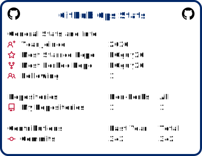

# Brad Couch

## 🚀 Building Systems for Real-World Operations

I design and develop tools that solve logistical and management challenges in equipment rental, sales, and operations.

---

## 🔧 What I Work On

- CRM & Pipeline Architecture
- Rental & Asset Lifecycle Management
- Territory Segmentation Systems
- Operational Dashboards
- Process Automation
- Data Intelligence for Sales Teams

## 🛠 Tech Stack

---

## 🏗 Current Focus

Building scalable internal tools that:
- Reduce friction in field sales
- Improve rental asset visibility
- Turn dealership data into actionable insights

---

## 📊 Philosophy

Software should remove operational friction, not create it.

## 🇺🇸 My GitHub Stats

